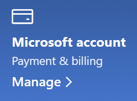

# Promjena podataka o Microsoftovu računuChange my Microsoft account information

Ako je [https://account.microsoft.com](https://account.microsoft.com/) potrebno, idite na i prijavite se.Go to [https://account.microsoft.com](https://account.microsoft.com/) and sign in if necessary. To će vas odvesti na nadzornu ploču računa.This will take you to your account dashboard.  

**Uređivanje imena i osobnih podataka****Edit my name and personal information**

1. Na nadzornoj ploči računa pokraj slike računa i naziva kliknite tri točke (dodatne akcije) > Uređivanje profila\*\*.On your account dashboard, next to your account picture and name, click the three dots (more actions) > Edit profile\*\*.
2. Na **stranici Uređivanje** profila pomoću veza promijenite profilnu sliku, ime, datum rođenja, mjesto i preferencije jezika prikaza.On the **Edit profile** page, use the links provided to change your profile picture, name, date of birth, location, and display language preference. Obratite pozornost na veze na profile za Xbox ili Skype računa, gdje možete promijeniti pojedinosti specifične za te račune.Note the links to your Xbox or Skype account profiles, where you can change details specific to these accounts.

**Upravljanje adresama e-pošte i telefonskim brojevima****Manage e-mail addresses and phone numbers**

Microsoftov račun ima jednu ili više adresa e-pošte ili telefonskih brojeva povezanih s njim kao "pseudonime".A Microsoft account has one or more e-mail addresses or phone numbers associated with it as “aliases.” Da biste upravljali ovim:To manage these:

1. Na nadzornoj ploči računa pokraj slike računa i naziva kliknite tri točke (dodatne akcije) > **Uređivanje profila**.On your account dashboard, next to your account picture and name, click the three dots (more actions) > **Edit profile**.
2. Na **stranici Uređivanje** profila kliknite **Upravljanje načinom prijave u Microsoft**.On the **Edit profile** page, click **Manage how you sign in to Microsoft**. 
3. Vidjet ćete popis pseudonima računa i možete upravljati popisom, uključujući dodavanje i brisanje adresa e-pošte i telefonskih brojeva.You will see a list of account aliases, and you can manage the list, including adding and deleting e-mail addresses and phone numbers. Ovdje možete odabrati i pseudonime koji se mogu koristiti za prijavu na račun i koji se pseudonim smatra "primarnim", koji će se prikazati na Windows 10 uređajima.Here you can also select which aliases can be used to sign in to the account, and which alias is considered “primary,” which will be displayed on your Windows 10 devices.

**Upravljanje načinima plaćanja te nazivom i adresom za naplatu****Manage payment methods, as well as name and address for billing** 

1. Na nadzornoj ploči računa pokraj slike računa i naziva kliknite tri točke (dodatne akcije) > **Uređivanje profila**.On your account dashboard, next to your account picture and name, click the three dots (more actions) > **Edit profile**.
2. U **odjeljku Plaćanje & kliknite** **Upravljanje**.Under **Payment & billing** click **Manage**.

    

3. Ovdje možete dodavati, uređivati i uklanjati načine plaćanja te njihove povezane adrese za naplatu.Here you can add, edit, and remove payment methods and their associated billing addresses. 
