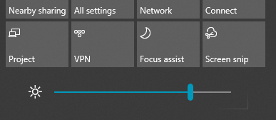

# Promjena svjetline zaslona u sustavu Windows 10

Ako je vaš Windows 10 noviji od verzije 1903, u akcijskom centru nalazi se **klizač svjetline.** Da biste otvorili akcijski centar, kliknite gumb **Obavijesti** na desnoj strani programske trake ili pritisnite **Windows home + A** na tipkovnici.

Ako je vaš Windows 10 starija verzija, klizač svjetline možete pronaći tako da **[odete](ms-settings:display?activationSource=GetHelp)** na Postavke > Sustav > Zaslon .

**Napomene**:

- Možda nećete vidjeti klizač Promjena svjetline ugrađenog zaslona na stolnim PC-jevima s vanjskim monitorom. Da biste promijenili svjetlinu vanjskog monitora, koristite kontrole na monitoru.
- Ako nemate stolno računalo, a klizač se ne prikazuje ili ne funkcionira, pokušajte ažurirati upravljački program za prikaz. U okvir pretraživanja na programskoj traci upišite **Upravitelj uređaja**, a zatim s popisa rezultata odaberite **Upravitelj uređaja.** U **upravitelju uređaja**odaberite **Prilagodnici za prikaz**, a zatim odaberite prilagodnik za prikaz. Pritisnite i držite (ili kliknite desnom tipkom miša) naziv grafičkog prilagodnika i kliknite **Ažuriraj upravljački program**; zatim slijedite upute.
