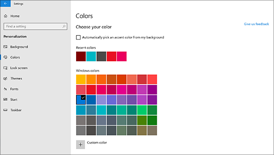

# Promjena pozadine i boja radne površine

Da biste promijenili postavku boja, otvorite **Izbornik** Boje za personalizaciju postavki , a zatim odaberite vlastitu boju ili dopustite sustavu Windows da povuče  >    >    >  boju isticanja iz pozadine.

Da biste promijenili pozadinu radne površine, otvorite **Izbornik** Postavke Personalizacija Pozadina , a zatim odaberite sliku, pune boje ili stvorite  >    >    >  dijaprojekciju slika. 

Želite li još pozadina i boja radne površine? Posjetite [Microsoft Store da](https://www.microsoft.com/store/collections/windowsthemes) biste odabrali nekoliko desetaka besplatnih tema.
