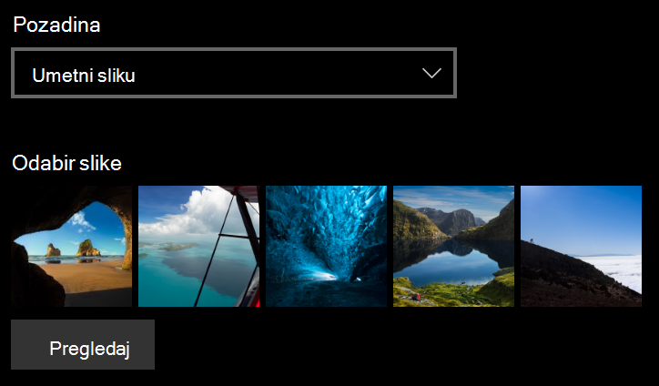
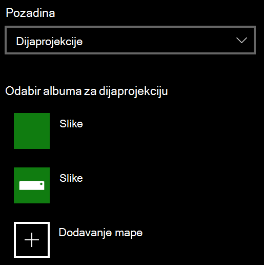

# Promjena pozadine zaključanog zaslona

- Idite na **Zaključani zaslon****za personalizaciju** > **postavki** > . Ili kliknite ili dodirnite [ovdje](ms-settings:lockscreen?activationSource=GetHelp).

- Da biste postavili prilagođenu pozadinsku sliku, na padajućem popisu **Pozadina** odaberite **Slika** i odaberite ili **Pregledajte** sliku.

  

- Da biste postavili dijaprojekciju prilagođenih slika, s padajućeg popisa **Pozadina** odaberite **Dijaprojekcija** i odaberite album ili dodajte mapu koja sadrži slike za dijaprojekciju.

  
