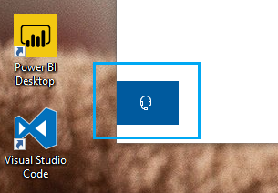

# Obratite nam se klikom na gumb za slušaliceContact us by clicking the headphone button

Ako želite kontaktirati Microsoftovu podršku, kliknite **Kontaktirajte nas** u donjem lijevom kutu ove aplikacije.If you'd like to contact Microsoft Support, please click **Contact us** in the lower left corner of this app. Unutar fly-out prozora, od vas će biti vođeni na pravo kanal za podršku nakon odabira vašeg proizvoda i kategorije problema.Inside the fly-out window, you will be guided to the right support channel after choosing your product and issue category.

Možete nastaviti komunicirati s ostatkom aplikacije čak i nakon što pokrenete sesiju Obratite nam se.You can keep interacting with the rest of the app even after you have initiated a Contact us session. Ploča Kontakti može se privremeno minimizirati klikom na bilo gdje drugdje unutar aplikacije.The Contact us panel can be temporarily minimized by clicking anywhere else inside the app. Da biste se vratili na istu sesiju, ponovno **nas kontaktirajte.**To return to the same session, just click **Contact us** again.
