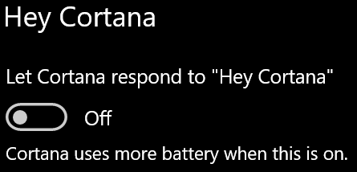

# Cortana ne razgovara sa mnom ili me ne čujeCortana doesn’t talk to me or can’t hear me

Ako pokušavate koristiti značajku "Hej Cortana", koja vam omogućuje da razgovarate s Cortanom bez odabira gumba Cortana na programskoj traci ili gumba mikrofona na ploči Cortana, potvrdite da je značajka omogućena:If you are trying to use the "Hey Cortana" feature, which allows you to talk to Cortana without selecting the Cortana button on the taskbar or the microphone button in the Cortana panel, confirm that the feature is enabled:

1. Idite na **Start**, a zatim odaberite **[Postavke > Cortani](ms-settings:cortana?activationSource=GetHelp)**.Go to **Start**, then select **[Settings > Cortana](ms-settings:cortana?activationSource=GetHelp)**.
2. U odjeljku **Hej Cortana**prebacite prekidač **Neka Cortana odgovori na "Hej Cortana"** na **Uključeno**.Under **Hey Cortana**, switch the **Let Cortana respond to "Hey Cortana"** toggle to **On**.

**Sprječavaju li vas vaše postavke privatnosti da vas Cortana čuje?****Are your privacy settings preventing Cortana from hearing you?**

Vaše postavke privatnosti mogu spriječiti Cortanu da reagira na vaš glas.Your privacy settings can prevent Cortana from responding to your voice.
- Provjerite je li uključeno prepoznavanje govora na mreži:Check to make sure Online Speech recognition is turned on:
    - Idite na **Start**, a zatim kliknite **[Postavke > Privatnost > govor .](ms-settings:privacy-speech?activationSource=GetHelp)**Go to **Start**, then click **[Settings > Privacy > Speech](ms-settings:privacy-speech?activationSource=GetHelp)**.
    - U **odjeljku Prepoznavanje govora**na mreži prebacite postavku na **Uključeno**.Under **Online speech recognition**, switch the setting to **On**.
- Provjerite ima li Cortana dozvolu za pristup mikrofonu.Check to make sure Cortana has permission to access your microphone. 
    - Idite na Start, a zatim kliknite **[Postavke > Privatnosti > mikrofon](ms-settings:privacy-microphone?activationSource=GetHelp)**.Go to Start, then click **[Settings > Privacy > Microphone](ms-settings:privacy-microphone?activationSource=GetHelp)**.
    - U **odjeljku Odabir aplikacija koje mogu pristupiti mikrofonu**potražite **Cortanu** na popisu aplikacija i servisa i provjerite je li prekidač uključen na **Uključeno**.Under **Choose which apps can access your microphone**, look for **Cortana** within the list of apps and services and make sure the switch is toggled to **On**.

Osim toga, provjerite jesu li zvučnici ili mikrofoni u pokretu i rade kako biste razgovarali s Cortanom.Moreover, please also make sure that your speakers or microphones are up and working in order to talk to Cortana.
