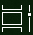

# Učinite više zadataka u sustavu Windows 10Do more with multitasking in Windows 10

Da biste vidjeli ili se prebacili između aplikacija: na programskoj traci možete kliknuti gumb **Prikaz zadatka** ili pritisnuti **Tipku Alt-Tab** na tipkovnici.To see or switch between apps: you can click the **Task View** button in the taskbar, or press **Alt-Tab** on your keyboard. Gumb Prikaz zadataka izgleda ovako:The Task View button looks like this:

Da biste jednostavno rasporedili dvije aplikacije jedna uz drugu, upotrijebite pomoć za poravnanje: zgrabite vrh prozora aplikacije i povucite je na jednu stranu da biste je "ugrizali" na tu polovicu zaslona.To easily arrange two apps side by side, use Snap Assist: grab the top of an app window and drag it to one side to "snap" it to that half of the screen. Zatim odaberite drugu aplikaciju i automatski će se uvući na svoje mjesto u drugoj polovici zaslona.Then choose another app and it will automatically snap into place in the other half of the screen.

**Da biste stvorili različite virtualne radne površine za dom i posao:****To create different virtual desktops for home and work**:

1. Kliknite gumb **Prikaz zadatka** na programskoj traci ili pritisnite **Alt-Tab** na tipkovnici.Click the **Task View** button in the taskbar, or press **Alt-Tab** on your keyboard.
2. Kliknite **+ Nova radna površina** (nalazi se u gornjem lijevom kutu zaslona dok je u prikazu zadatka).Click **+ New Desktop** (located at the top left of your screen while in task view).
3. Otvorite aplikacije koje želite koristiti.Open the apps you want to use. 

Vratite se u **prikaz zadataka** da biste vidjeli radne površine i prebacili se između njih.Go back to **Task View** to see your desktops and switch between them.
