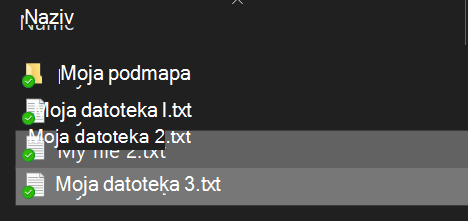
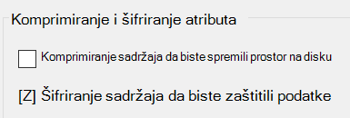

# Šifriranje datoteka ili mape u sustavu Windows 10

Cijeli disk možete šifrirati pomoću značajke BitLocker, ali šifrirati samo pojedinačne datoteke ili mape (i njihov sadržaj):

1. U **eksploreru za datoteke**odaberite datoteke/mape koje želite šifrirati. U ovom primjeru odabrane su dvije datoteke:

    

2. Desnom tipkom miša kliknite odabrane datoteke, a zatim kliknite **Svojstva**.

3. U prozoru **Svojstva** kliknite **Dodatno**.

4. U prozoru **Napredna svojstva** potvrdite okvir **Šifriraj sadržaj da biste zaštitili podatke:**

    

5. Kliknite **U redu**.
