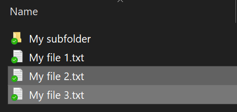

# Šifriranje datoteka ili mape u sustavu Windows 10Encrypt files or folder in Windows 10

Cijeli disk možete šifrirati pomoću značajke BitLocker, ali šifrirati samo pojedinačne datoteke ili mape (i njihov sadržaj):You can encrypt an entire disk using BitLocker, but to encrypt only individual files or folders (and their contents):

1. U **eksploreru za datoteke**odaberite datoteke/mape koje želite šifrirati.In **File Explorer**, select the file(s)/folder(s) you want to encrypt. U ovom primjeru odabrane su dvije datoteke:In this example, two files have been selected:

    

2. Desnom tipkom miša kliknite odabrane datoteke, a zatim kliknite **Svojstva**.Right-click the selected files and click **Properties**.

3. U prozoru **Svojstva** kliknite **Dodatno**.In the **Properties** window, click **Advanced**.

4. U prozoru **Napredna svojstva** potvrdite okvir **Šifriraj sadržaj da biste zaštitili podatke:**In the **Advanced Properties** window, select the **Encrypt contents to secure data** checkbox:

    

5. Kliknite **U redu**.Click **OK**.
