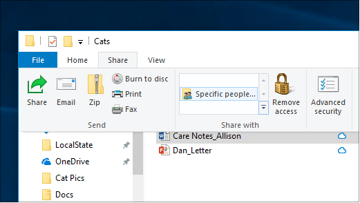
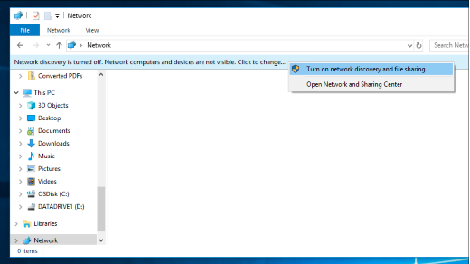

# Zajedničko korištenje datoteka putem mreže u sustavu Windows 10File sharing over a network in Windows 10

**Napomena:** ako ste za zajedničko korištenje datoteka koristili HomeGroup, imajte na umu da je Osnovna grupa uklonjena iz sustava Windows 10 (verzija 1803).**Note**: If you previously used HomeGroup for file sharing, please note that HomeGroup has been removed from Windows 10 (Version 1803). Pisače i datoteke sada možete zajednički koristiti pomoću ugrađenih značajki u sustavu Windows 10.You can now share printers and files by using built-in features in Windows 10.

**Zajedničko korištenje datoteka i mapa putem mreže****To share files or folders over a network**

- U **eksploreru** za datoteke odaberite > kliknite karticu **Zajedničko** korištenje pri vrhu > **odjeljku** Zajedničko korištenje s kliknite **Određene osobe**.In **File Explorer**, select a file > click the **Share** tab at the top > in the **Share with** section, click **Specific people**.

    
          
- Ako odjednom odaberete više datoteka, možete ih zajednički koristiti na isti način.If you select multiple files at once, you can share them all in the same way. Funkcionira i za mape.It works for folders, too.

**Da biste vidjeli uređaje na mreži koji zajednički dijele datoteke****To see devices on the network that are sharing files**

- U **eksploreru za** datoteke idite na **Mreža**.In **File Explorer**, go to **Network**. Ako otkrivanje mreže nije omogućeno, vidjet ćete poruku o pogrešci "Otkrivanje mreže je isključeno..."If Network discovery is not enabled, you will see an error message "Network discovery is turned off..."

- Kliknite natpis **Otkrivanje mreže, a zatim** Uključi otkrivanje mreže i zajedničko korištenje **datoteka.**Click the **Network discovery is turned off** banner, then click **Turn on network discovery and file sharing**.

    

[Dodatne informacije o zajedničkom korištenju datoteka putem mrežeRead more about file sharing over a network](https://support.microsoft.com/help/4092694/windows-10-file-sharing-over-a-network)

[Zajedničko korištenje datoteka pomoću aplikacija, servisa OneDrive, poruka e-pošte i još mnogo togaShare files using apps, OneDrive, emails, and more](https://support.microsoft.com/help/4027674/windows-10-share-files-in-file-explorer)
