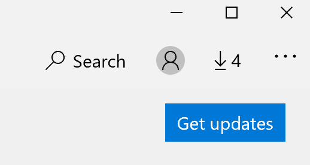

# Rješavanje problema s jezikom prikaza aplikacija

Kada promijenite jezik prikaza u sustavu Windows 10, neke aplikacije i dalje mogu koristiti prethodni jezik kada ih otvorite. To se događa jer se nove verzije aplikacija za taj jezik moraju preuzeti iz trgovine Store. Da biste riješili taj problem, možete pričekati automatsko ažuriranje ili ručno instalirati ažuriranu verziju aplikacija.

Da biste ručno instalirali ažuriranje, **otvorite Microsoft Store,** a **zatim u gornjem** desnom kutu kliknite Preuzimanja i ažuriranja. Zatim kliknite **Preusmj.** Ako se jezik ne promijeni nakon dovršavanja ažuriranja, pokušajte ponovno pokrenuti PC.

Dodatne informacije o postavkama jezika unosa i prikaza potražite u članku Upravljanje postavkama [jezika unosa i prikaza u sustavu Windows 10](https://support.microsoft.com/help/4027670/windows-10-add-and-switch-input-and-display-language-preferences).
