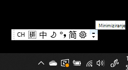
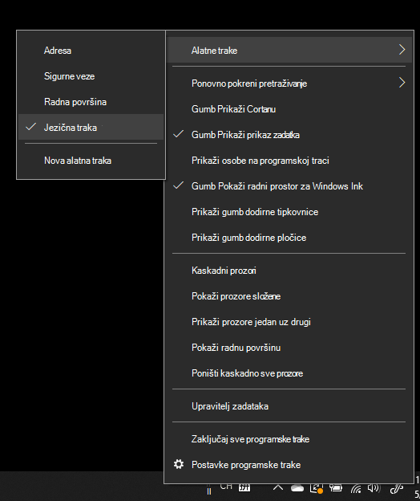
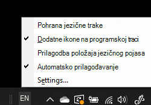

# Skrivanje, prikaz ili vraćanje jezične trake na izvorne postavke

**Da biste smanjili jezičnu traku:**

Možete kliknuti gumb za minimiziranje u gornjem desnom kutu jezične trake. Ili možete jednostavno povući jezičnu traku na programsku traku, čime će se ona automatski minimizirati.

**Da biste odvojili jezičnu traku:**

Ako jezičnu traku ne želite usidriti i programskoj traci, kliknite desnom tipkom miša bilo koji prazan prostor na programskoj traci i odznačite mogućnost **Jezična traka** u izborniku Alatne trake. Time će se jezična traka prikazati izvan programske trake, baš kao na prethodnoj snimci zaslona.

**Da biste vratili jezičnu traku na zadane vrijednosti:**

Kliknite desnom tipkom miša na gumb za jezik u alatnoj traci i kliknite mogućnost **Vraćanje jezične trake** u izborniku. Time će se ona vratiti na zadane postavke.

