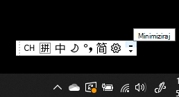

# Sakrivanje, prikaz ili ponovno postavljanje jezične trakeHide, display, or reset the language bar

**Da biste minimizirali jezičnu traku:****To minimize the language bar:**

U gornjem desnom kutu jezične trake možete kliknuti gumb za minimiziranje.You can click the minimize button on the top right corner of the language bar. Ili možete samo povući jezičnu traku na programsku traku, koja će je automatski minimizirati.Or, you can just drag the language bar to the task bar, which will automatically minimize it.

**Da biste izašli iz jezične trake:****To pop out the language bar:**

Ako ne želite usidriti jezičnu traku na programskoj traci, desnom tipkom miša kliknite prazan prostor na programskoj traci i poništite mogućnost **Jezična traka** na izborniku Alatne trake.If you don't want to dock the language bar in the taskbar, right-click any empty space in the taskbar, and uncheck the **Language bar** option in the Toolbars menu. To će učiniti da se jezična traka pojavi izvan programske trake, baš kao i prethodna snimka zaslona.This will make the language bar appear outside the taskbar, just like the previous screenshot.

**Da biste jezičnu traku vratili na zadano:****To restore the language bar to default:**

Desnom tipkom miša kliknite gumb jezika na alatnoj traci, a zatim na izborniku kliknite Vrati mogućnost **jezične trake.**Right-click the language button in the toolbar, and click **Restore the language bar** option in the menu. Time će se vratiti na zadano.This will restore it to default.

