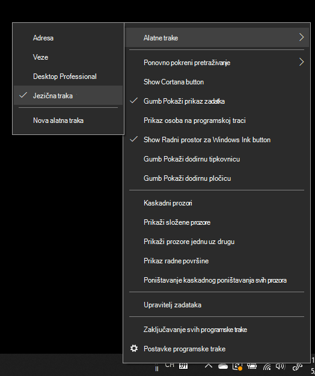

# Skrivanje, prikaz ili vraćanje jezične trake na izvorne postavkeHide, display, or reset the language bar

**Da biste smanjili jezičnu traku:****To minimize the language bar:**

Možete kliknuti gumb za minimiziranje u gornjem desnom kutu jezične trake.You can click the minimize button on the top right corner of the language bar. Ili možete jednostavno povući jezičnu traku na programsku traku, čime će se ona automatski minimizirati.Or, you can just drag the language bar to the task bar, which will automatically minimize it.

**Da biste odvojili jezičnu traku:****To pop out the language bar:**

Ako jezičnu traku ne želite usidriti i programskoj traci, kliknite desnom tipkom miša bilo koji prazan prostor na programskoj traci i odznačite mogućnost **Jezična traka** u izborniku Alatne trake.If you don't want to dock the language bar in the taskbar, right-click any empty space in the taskbar, and uncheck the **Language bar** option in the Toolbars menu. Time će se jezična traka prikazati izvan programske trake, baš kao na prethodnoj snimci zaslona.This will make the language bar appear outside the taskbar, just like the previous screenshot.

**Da biste vratili jezičnu traku na zadane vrijednosti:****To restore the language bar to default:**

Kliknite desnom tipkom miša na gumb za jezik u alatnoj traci i kliknite mogućnost **Vraćanje jezične trake** u izborniku.Right-click the language button in the toolbar, and click **Restore the language bar** option in the menu. Time će se ona vratiti na zadane postavke.This will restore it to default.

