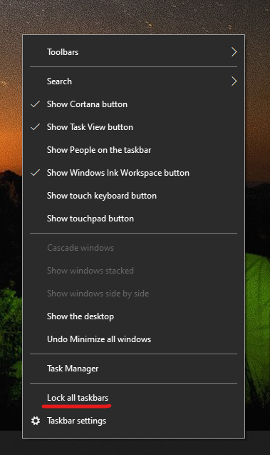

# Premještanje programske trake na bilo koju stranu ili vrh radne površine

Najprije provjerite je li programska traka otključana. Da biste saznali je li vaš otključan, desnom tipkom miša kliknite prazan razmak na programskoj traci i provjerite **je li na programskoj traci** uz nju zaključana kvačica. Ako je potvrđeno, programska je traka zaključana i nije je moguće premjestiti. Klikom **na Zaključaj programsku traku** jednom će se otključati i ukloniti kvačicu.

Ako imate više monitora koji prikazuju programsku traku, prikazat će se **zaključavanje svih traka zadataka**.

Kada se programska traka otključa, možete pritisnuti i držati prazan razmak na programskoj traci i odvući ga na željeno mjesto na zaslonu. To možete učiniti i tako da desnom tipkom miša kliknete na prazno mjesto na programskoj traci i odete na ** [Postavke programske trake](ms-settings:taskbar?activationSource=GetHelp) > na zaslonu**.
