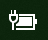
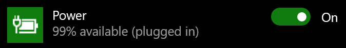

# U sustavu Windows 10 nema ikone napajanja ili baterijePower or battery icon missing in Windows 10

Ako uređaj sa sustavom Windows 10 ima bateriju (npr. prijenosno računalo, tablet ili PC povezan s UPS-om putem USB-a), obično se na programskoj traci u blizini sata prikazuje ikona napajanja/baterije, na primjer:If your Windows 10 device has a battery (e.g., laptop or tablet, or a PC connected via USB to a UPS), normally a power/battery icon is shown in the taskbar near the clock, for example:

Ako ne vidite tu ikonu, možda je skrivena:If you don't see this icon, it may be hidden:

1. Otvorite **[Postavke > Personalizacija > Programska traka](ms-settings:taskbar?activationSource=GetHelp)**.Go to **[Settings > Personalization > Taskbar](ms-settings:taskbar?activationSource=GetHelp)**.

2. U području obavijesti kliknite mogućnost **Odaberite koje će se ikone prikazivati na programskoj traci**.In the Notification area, click **Select which icons appear on the taskbar**.

3. Potom na popisu pronađite stavku **Napajanje** i prebacite njezinu postavku na **Uključeno**.Then find the **Power** item in the list and toggle its setting to **On**.

    

**Otklanjanje poteškoća****Troubleshooting**

Ako ste slijedili navedene upute, ali je prekidač **Napajanje** zasivljen ili nije vidljiv, u okvir za pretraživanje na programskoj traci upišite **upravitelj uređaja**, a zatim na popisu rezultata odaberite **Upravitelj uređaja**.If you followed the above instructions and the **Power** toggle is greyed out or not visible, in the search box on the taskbar, type **device manager**, and then select **Device Manager** in the list of results. U odjeljku **Baterije**, desnom tipkom miša kliknite bateriju svojeg uređaja te kliknite **Onemogući**, a zatim **Da**.Under **Batteries**, right-click the battery for your device, click **Disable**, and click **Yes**. Pričekajte nekoliko sekundi pa desnom tipkom miša kliknite bateriju, a zatim **Omogući**.Wait a few seconds, and then right-click the battery and click **Enable**. Potom ponovno pokrenite uređaj.Then restart your device.

Ako ste slijedili navedene upute, ali se ikona baterije ne prikazuje na programskoj traci, u okvir za pretraživanje na programskoj traci upišite **upravitelj zadataka**, a zatim na popisu rezultata kliknite **Upravitelj zadataka**.If you followed the above instructions, but the battery icon does not appear on the taskbar, in the search box on the taskbar, type **task manager**, and then click **Task Manager** in the list of results. Na kartici **Procesi** u odjeljku **Naziv** desnom tipkom miša kliknite **Explorer**, a zatim **Ponovno pokreni**.On the **Processes** tab, under **Name**, right-click **Explorer**, and then click **Restart**.
