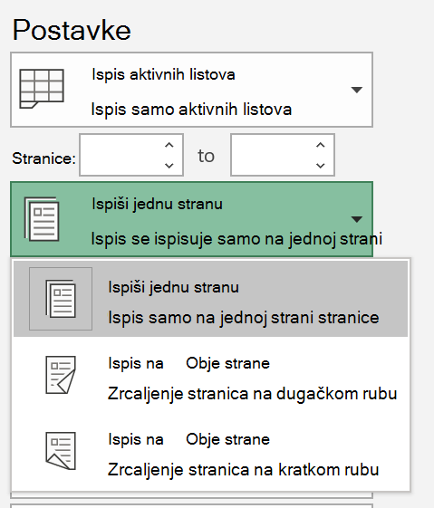
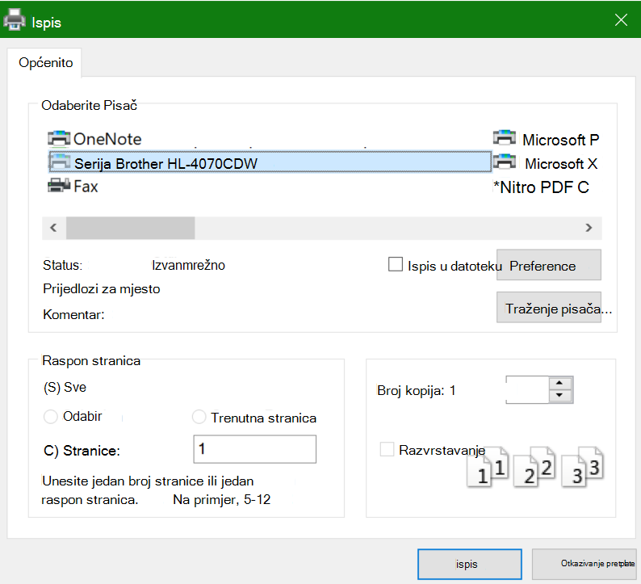

# Ispis na obje strane papira (obostrani ispis)

**Može li pisač obostrani ispis?**

Sažetak značajki pisača ili priručnik trebao bi vam reći može li ispisivati s obje strane papira, što se naziva i "obostrani ispis". Ako imate Microsoft Office, drugi je način da to otkrijete tako da otvorite aplikacija Office kao što su Word ili Excel, **otvorite Datoteka > Ispis**, provjerite je li odabran pravi pisač i tražite mogućnost u odjeljku Postavke. Na primjer: 

**Obostrani ispis u Microsoft Office**

Ako pisač može ispisivati s obje strane, kada idite na **Datoteka > Ispis** u aplikacija Office, vidjet ćete mogućnost "Ispis na obje strane", kao što je prikazano u prethodnom primjeru.  Odaberite željenu vrstu obostranog ispisa (preklopom na dugačkom rubu ili preklopom na kratkom rubu), a zatim **kliknite** Ispis da biste pokrenuli ispis.

**Obostrani ispis iz bilo koje aplikacije**

U mnogim aplikacijama prilikom ispisa vidjet ćete općeniti dijaloški okvir za ispis koji izgleda ovako: 

Provjerite je li odabran desni pisač, a zatim kliknite **Preference da biste** otvorili prozor preferenci pisača. Ako pisač može obostrani ispis, mogućnost omogućivanja trenutnog ispisa prikazuje se u tom prozoru.
