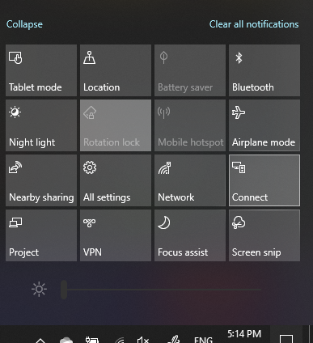

# Project to a PCProject to a PC

Na odredišnom uređaju (projiciranje na) potražite "Postavke projekcije" da biste otvorili stranicu Postavke **projiciranje na ovaj PC.**On your destination device (projecting to), search for "Projection Settings" to open the Settings page of **Projecting to this PC**. Zatim provjerite sljedeće:Then make sure that:
- Padajući izbornik "Neki uređaji sa sustavom Windows i Android mogu projicirati na ovaj PC kada kažete da je u redu" postavljen je na **Uvijek isključeno**."Some Windows and Android devices can project to this PC when you say it's OK" drop-down menu is set to **Always Off**.
- Padajući izbornik "Pitaj za projekt na ovaj PC" postavljen je na **Svaki put kada je potrebna veza.**"Ask to project to this PC" drop-down menu is set to **Every time a connection is required**.
- Padajući izbornik "Zahtijevaj PIN za uparivanje" postavljen je na **Nikad**."Require PIN for pairing" drop-down menu is set to **Never**.

Na odredišnom uređaju pokrenite **aplikaciju Poveži** se tako da ode na **Izbornik Start** i potražite "Poveži se".On your destination device, launch **Connect** app by going to **Start** and search for "Connect".

Zatim na izvorišnom uređaju s kojeg pokušavate projicirati:Then, on your source device that you are trying to project from:

1. Pritisnite **tipku Sustava Windows + A da** biste otvorili akcijski centar.Press **Windows key + A** to open Action Center.
2. Kliknite **Poveži** se .Click **Connect**.
3. Kliknite uređaj na koji želite projicirati zaslon.Click the device you want to project the screen to.

Nakon gore navedenih koraka odredišni uređaj trebao bi prikazati zaslon izvorišnog uređaja kao da je sekundarni monitor.After the above steps, your destination device should display the screen of the source device as if it is a secondary monitor.
