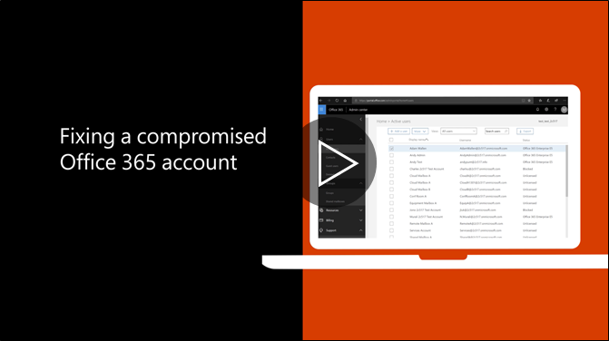

# Preporučene korake koje treba poduzeti ako ugrožena račun

  
1. Odmah [Vrati izvornu lozinku korisnika](https://support.office.com/article/7a5d073b-7fae-4aa5-8f96-9ecd041aba9c) . Komunicirati novu lozinku putem e-pošte krajnjeg korisnika. 
    
2. Uklonite sve sumnjivih [Prosljeđivanje adrese](https://support.office.com/article/ab5eb117-0f22-4fa7-a662-3a6bdb0add74) postaviti na razini poštanskog sandučića. 
    
3. Uklanjanje svih sumnjivih [pravila ulazne pošte](https://support.office.com/article/1433E3A0-7FB0-4999-B536-50E05CB67FED) postavite unutar poštanski sandučić. 
    
4. Ako korisnik blokirano slanje e-pošte, [idite na ograničenom korisnicima deblokirati račun](https://protection.office.com/?hash=/restrictedusers). Kada to učinite, korisnika trebali biste moći nastaviti slanje poruka unutar 1 sat.
    
5. Ukloniti korisnički račun iz sve [grupe uloga Administrativni](https://support.office.com/article/eac4d046-1afd-4f1a-85fc-8219c79e1504) dok ste sigurni da račun u više ugrožena. 
    
Da biste minimizirali potencijalni kršenje podataka ili compromised računa u budućnosti, preporučujemo čitanja naše [najbolje prakse članak Office 365 sigurnosti](https://support.office.com/article/9295e396-e53d-49b9-ae9b-0b5828cdedc3).
  

