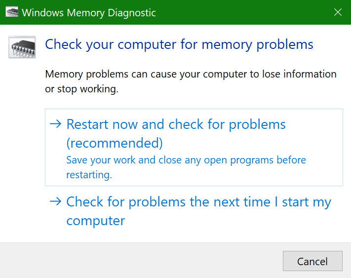

# Pokretanje Windows dijagnostike memorije u Windows 10

Ako Windows aplikacije i aplikacije na PC-ju rušiju, zamrzavanje ili djeluju na nestabilan način, možda imate problema s memorijom PC-ja (RAM-om). Možete pokrenuti dijagnostiku Windows memorije da biste provjerili ima li problema s RAM-om PC-ja.

U okvir za pretraživanje na programskoj traci upišite **dijagnostika memorije**, a zatim odaberite **Windows dijagnostiku memorije**. 

Da biste pokrenuli dijagnostiku, PC se mora ponovno pokrenuti. Imate mogućnost da se odmah ponovno pokrenete (spremite svoje radne dokumente i najprije zatvorite otvorene dokumente i poruke e-pošte) ili zakažete automatsko pokretanje dijagnostike prilikom sljedećeg ponovnog pokretanja PC-ja:

Kada se PC ponovno pokrene, Windows dijagnostički alat **za dijagnostiku memorije** automatski će se pokrenuti. Status i napredak prikazat će se kao pokretanje dijagnostike, a možete otkazati dijagnostiku tako da na tipkovnici ujete **tipku ESC.**

Kada se dijagnostika dovrši, Windows će normalno početi.
Odmah nakon ponovnog pokretanja, kada se pojavi radna površina, pojavit će se obavijest (pokraj ikone **Akcijskog** centra na programskoj traci) da bi se naznačilo jesu li pronađene pogreške u memoriji. Na primjer:

Evo ikone Akcijskog centra:  

I ogledna obavijest: 

Ako ste propustili obavijest, možete odabrati ikonu **Akcijskog** centra na programskoj traci da biste prikazali **akcijski** centar i vidjeli popis obavijesti koji se može pomicati.

Da biste pregledali detaljne informacije, **upišite** događaj u okvir za pretraživanje na programskoj traci, a zatim **odaberite Preglednik događaja**. U lijevom **oknu preglednika** događaja pomaknite se do Windows **Zapisnici > System**. U desnom oknu pregledajte popis dok pregledavate stupac **Izvor** dok ne vidite događaje s izvorišnom vrijednošću **MemoryDiagnostics-Results**. Isticanje svakog takvog događaja i prikaz informacija o rezultatima u okviru ispod **kartice** Općenito ispod popisa.
