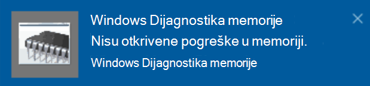

# Pokretanje dijagnostike memorije u sustavu Windows u sustavu Windows 10

Ako se prozori i aplikacije na PC-ju raspada, zamrzavaju ili djeluju na nestabilan način, možda ćete imati problema s memorijom (RAM-om) PC-ja. Možete pokrenuti dijagnostiku memorije sustava Windows da biste provjerili ima li problema s RAM-om PC-ja.

U okvir za pretraživanje na programskoj traci upišite **Dijagnostika memorije**, a zatim odaberite **Dijagnostika memorije u sustavu Windows**. 

Da biste pokrenuli dijagnostiku, potrebno je ponovno pokrenuti PC. Imate mogućnost odmah ponovno pokrenuti (spremite svoj rad i zatvorite otvorene dokumente i e-poštu) ili zakazivanje automatskog pokretanja PC-ja prilikom sljedećeg ponovnog pokretanja računala:

Kada se PC ponovno pokrene, **alat za dijagnostiku memorije u sustavu Windows** pokrenut će se automatski. Status i tijek prikazat će se kao dijagnostički pokrenuti, a možete i poništiti dijagnostiku tako da kliknete tipku **Esc** na tipkovnici.

Kada se dijagnostika dovrši, Windows će se normalno pokrenuti.
Odmah nakon ponovnog pokretanja, kada se pojavi radna površina, prikazat će se obavijest (uz ikonu **akcijskog centra** na programskoj traci) da biste naznačili jesu li pronađene pogreške u memoriji. Na primjer:

Evo ikone akcijskog centra:  

I oglednu obavijest: 

Ako ste propušteni obavijest, možete odabrati ikonu **akcijskog centra** na programskoj traci da biste prikazali **akcijski centar** i pogledali popis obavijesti koji se mogu kretati.

Da biste pregledali detaljne informacije, upišite **Event** u okvir za pretraživanje na programskoj traci, a zatim odaberite **preglednik događaja**. U lijevom oknu **preglednika događaja**dođite do **zapisnika > sustava Windows**. U desnom oknu Skenirajte popis dok pogledate **izvorni** stupac dok ne vidite događaje s **memorijalnom dijagnostom**izvorne vrijednosti (rezultati). Istaknite svaki takav događaj i pogledajte informacije o rezultatu u okviru na kartici **Općenito** ispod popisa.
