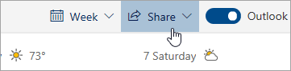

# Zajedničko korištenje s programom Outlook na webu

1. Pri dnu stranice odaberite Kalendar da biste otišli u Kalendar.

2. U kalendaru na alatnoj traci pri vrhu stranice odaberite **Zajedničko korištenje**i odaberite kalendar koji želite zajednički koristiti. 

    

    **Napomena**: Ne možete dijeliti kalendare u vlasništvu drugih osoba.

3. Unesite ime ili adresu e-pošte osobe s kojom želite zajednički koristiti kalendar.

4. Odaberite način na koji želite da osoba koristi vaš kalendar: 
    - **Može vidjeti kad sam zauzet**   omogućuje im da vide kada ste zauzeti, ali ne sadrži pojedinosti kao što je lokacija događaja. 
    - **Može pregledavati naslove i lokacije**   omogućuje im da vide kada ste zauzeti, kao i naslov i mjesto događaja. 
    - **Može vidjeti sve detalje**   omogućuje im da vide sve detalje vaših događaja. 
    - **Može uređivati**   omogućuje im uređivanje kalendara. 
    - **Delegat**   omogućuje im uređivanje kalendara i dijeljenje s drugima.

5. Odaberite **Zajedničko korištenje**. Ako odlučite da nećete odmah dijeliti kalendar, odaberite **Ukloni**. 

**Napomene**:  

- Kada zajednički koristite kalendar s nekim tko ne koristi Outlook na webu, primjerice netko tko koristi Gmail, pozivnicu će moći prihvatiti samo pomoću računa za Microsoft 365 ili Outlook.com. 

- ICS kalendari su samo za čitanje, pa čak i ako dodijelite pristup uređivanju drugim osobama, oni neće moći uređivati vaš kalendar. 

- Koliko često se ics kalendar sinkronizira ovisi o davatelju usluge e-pošte osobe s kojom ste ga podijelili. 

- Stavke kalendara označene kao privatne su zaštićene. Većina osoba s kojima dijelite kalendar vide samo vrijeme označenih kao privatne stavke, a ne naslov, mjesto ili druge pojedinosti. Ponavljajući niz označen kao privatan prikazat će i uzorak ponavljanja.
