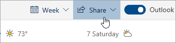

# Zajedničko korištenje s programom Outlook na webu

U kalendaru na alatnoj traci pri vrhu stranice odaberite **Zajedničko korištenje**i odaberite kalendar koji želite zajednički koristiti.

    

**Napomena:** ne možete dijeliti kalendare u vlasništvu drugih osoba.

- Unesite ime ili adresu e-pošte osobe s kojom želite zajednički koristiti kalendar.
- Odaberite način na koji osoba koristi kalendar:
    - **Može se vidjeti kada sam zauzet**   omogućuje im da vide kada ste zauzeti, ali ne uključuje pojedinosti kao što je lokacija događaja.
    - **Može pregledavati naslove i lokacije**   omogućuje im da vide kada ste zauzeti, kao i naslov i lokaciju događaja.
    - **Može vidjeti sve detalje**   omogućuje im da vide sve detalje vaših događaja.
    - **Može uređivati**   omogućuje im uređivanje kalendara.
    - **Delegat (delegat)**   omogućuje im uređivanje kalendara i njihovo zajedničko korištenje s drugima.
- Odaberite **Dijeli**.
