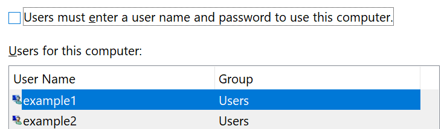

# Prijava u Windows 10 bez korištenja lozinke

Da biste izbjegli unos lozinke pri pokretanju sustava Windows, preporučujemo vam da koristite neku od mogućnosti za prijavu u Windows Hello, kao što su PIN, prepoznavanje lica ili otisak prsta, ako je dostupan. Ako zaista želite onemogućiti sigurnu prijavu, pročitajte upute u nastavku: "automatsko prijavljivanje u Windows 10".

**Sigurni Windows Hello alternative za lozinku računa**

Idite na **postavke > računi > mogućnosti prijave** (ili kliknite [ovdje](ms-settings:signinoptions?activationSource=GetHelp)). Dostupne mogućnosti prijave prikazat će se na popisu. Na primjer:

Kliknite ili dodirnite neku od mogućnosti da biste je konfigurirali. Kada sljedeći put pokrenete ili otključate Windows, moći ćete koristiti novu mogućnost umjesto lozinke. 

**Automatsko prijavljivanje u Windows 10**

**Pažnja**: automatsko prijavljivanje povoljno je, ali predstavlja sigurnosni rizik, osobito ako je na PC-ju dostupan više osoba. 

1. Kliknite ili dodirnite gumb **Start** na programskoj traci.

2. Upišite **netplwiz** i pritisnite tipku ENTER da biste otvorili prozor korisnički računi.

3. Na **korisničkim računima**kliknite račun na koji se želite automatski prijaviti prilikom pokretanja sustava Windows.

4. Poništite potvrdni okvir "korisnici moraju unositi korisničko ime i lozinku da bi koristili ovo računalo".

    

5. Kliknite **U redu**. Od vas će se zatražiti da unesete i potvrdite lozinku za odabrani račun. Kliknite **u redu** da biste završili. Kada se sljedeći put pokrene Windows 10, on će se automatski prijaviti na odabrani račun.
