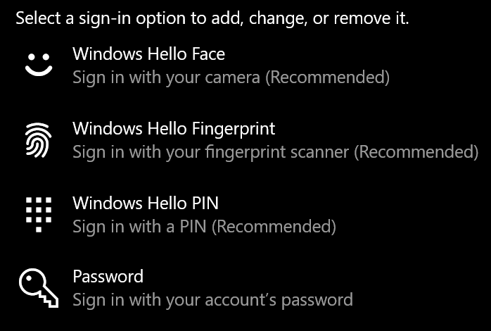
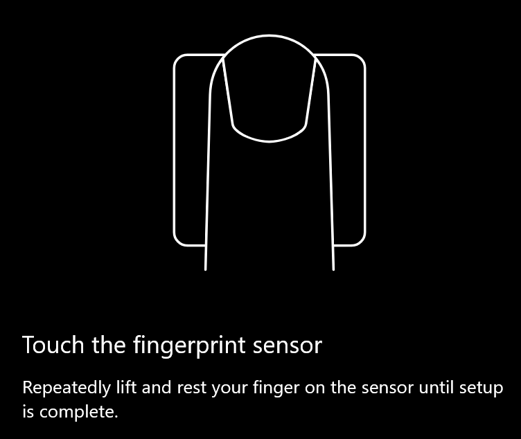
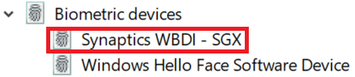

# Mogućnost otključavanja otiskom prsta u sustavu Windows 10Use fingerprint unlock option in Windows 10

**Omogućivanje otiska prsta u sustavu Windows Hello****Enable Windows Hello Fingerprint**

Da biste otključali Windows 10 pomoću otiska prsta, morate postaviti otisak prsta značajke Windows Hello tako da dodate (ostavljajući sustavu Windows da nauči prepoznati) barem jedan prst.To unlock Windows 10 using your fingerprint, you need to set up Windows Hello Fingerprint by adding (letting Windows learn to recognize) at least one finger. 

1. Otvorite **Postavke > računi > mogućnosti prijave** (ili kliknite [ovdje).](ms-settings:signinoptions?activationSource=GetHelp)Go to **Settings  > Accounts > Sign-in options** (or click [here](ms-settings:signinoptions?activationSource=GetHelp)). Na popisu će biti dostupne mogućnosti prijave.Available sign-in options will be listed. Na primjer:For example:

    

2. Kliknite ili dodirnite **Otisak prsta značajke Windows Hello**, a zatim **Postavi**.Click or tap **Windows Hello Fingerprint**, then click **Set up**. U prozoru za postavljanje značajke Windows Hello **kliknite Početak rada**.In the Windows Hello setup window, click **Get started**. Aktivirat će se senzor otiska prsta i od vas će se tražiti da postavite prst na senzor:The fingerprint sensor will activate, and you'll be asked to place your finger on the sensor:

   

3. Slijedite upute koje će od vas tražiti da više puta skenirate prst.Follow the instructions, which will ask you to repeatedly scan your finger. Kada to završite, možete dodati i druge prste koje biste mogli koristiti za prijavu.When this is finished, you'll have the option of adding other fingers you may want to use for sign-in. Kada se sljedeći put prijavite u Windows 10, za to ćete imati mogućnost korištenja otiska prsta.Next time you sign in to Windows 10, you will have the option of using your fingerprint to do so.

**Windows Hello Fingerprint not available as a sign-in option****Windows Hello Fingerprint not available as a sign-in option**

Ako se u mogućnostima prijave ne prikazuje otisak prsta u sustavu Windows Hello **,** to znači da Windows nije upoznat s čitačem otisaka prstiju/skenerom priloženim na PC-ju ili da pravilnik sustava sprječava njegovo korištenje (ako, primjerice, računalom upravlja vaše radno mjesto).If Windows Hello Fingerprint is not shown as an option in **Sign-in options**, it means Windows is not aware of any fingerprint reader/scanner attached to your PC, or that a system policy prevents its use (if for example your PC is managed by your workplace). Da biste otklonili poteškoće:To troubleshoot: 

1. Odaberite **gumb Start** na programskoj traci i potražite Upravitelj **uređaja**.Select the **Start** button in the Taskbar and search for **Device Manager**.

2. Kliknite ili dodirnite da biste **otvorili Upravitelj uređaja**.Click or tap to open **Device Manager**.

3. U upravitelju uređaja proširite Biometrijske uređaje klikom na ševron.In Device Manager, expand Biometric devices by clicking its chevron.

   

4. Skener otiska prsta trebao bi biti naveden kao biometrijski uređaj, kao što je synaptics WBDI skener:Your fingerprint scanner should be listed as a biometric device, such as the Synaptics WBDI scanner:

   

5. Ako se skener otiska prsta ne prikazuje, a skener je integriran u PC, idite na web-mjesto proizvođača PC-ja.If your fingerprint scanner is not shown, and the scanner is integrated into your PC, go to the PC manufacturer's website. U odjeljku tehničke podrške za model PC-ja potražite upravljački program za Windows 10 za skener koji možete instalirati.In the technical support section for your PC model, search for a Windows 10 driver for a scanner that you can install.

6. Ako je skener odvojen od PC-ja (priložen putem USB-a), idite na web-mjesto proizvođača skenera da biste pronašli i instalirali softver za upravljačke programe uređaja sa sustavom Windows 10 za model skenera koji imate.If the scanner is separate from the PC (attached via USB), go to the scanner manufacturer's website to find and install Windows 10 device driver software for the scanner model you have.
