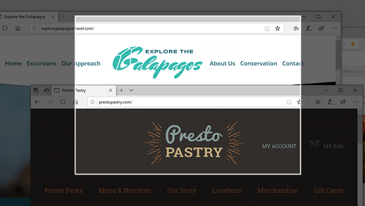
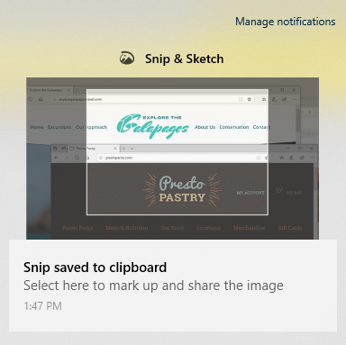

# Korištenje Izreznika & skica za hvatanje, označavanje i zajedničko korištenje slika

Skica zaslona sada se zove **izrezak & skica**. **Da biste brzo uzeli izrezak**, učinite sljedeće:

1. Pritisnite tipku s **logotipom sustava Windows + SHIFT + S**. Prikazat će vam se zamračiti zaslon i pokazivač pokazivača kao križ. 

2. Odaberite točku na rubu područja koje želite kopirati, a zatim desnom tipkom miša kliknite kursor. 

3. Pomaknite kursor da biste istaknuli područje koje želite snimiti. Područje koje snimite prikazat će se na zaslonu.

   

Slika koju ste izrezali sprema se u međuspremnik, spremna za lijepljenje u poruku e-pošte ili dokument. 

**Ako želite urediti ili prikazati sliku**, učinite sljedeće: 

- Kliknite ikonu obavijesti na krajnjem desnom dijelu programske trake. zatim kliknite sliku koju ste upravo snimili. Izrezak se otvara u aplikaciji izrezak & skica.

   
