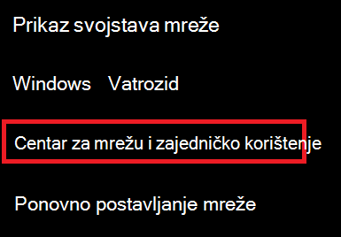
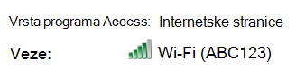
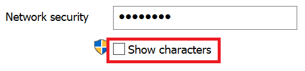

# Prikaz Wi-Fi mrežne lozinke u Windows 10

1. Provjerite je li Windows 10 PC povezan s Wi-Fi mrežom.

2. Idite **na Postavke > network & Internet > Status** ili  kliknite ili dodirnite ovdje da biste nam sada dopustili da vas tamo odvedemo.)

3. Kliknite **Centar za mrežu i zajedničko korištenje**.

    

4. U **centru za mrežu i** zajedničko korištenje pokraj **odjeljka** Veze vidjet ćete naziv bežične mreže. Ako, primjerice, vaša mreža ima naziv "ABC123", možda ćete vidjeti sljedeće:

    

    Kliknite naziv bežične mreže da biste otvorili prozor Wi-Fi status. 

5. U prozoru Wi-Fi status kliknite **Bežična svojstva**, kliknite **karticu Sigurnost,** a zatim **potvrdite okvir Prikaži znakove**.

    

